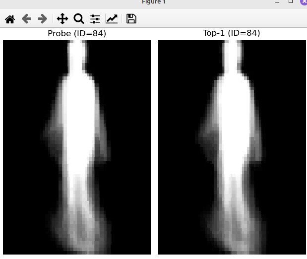
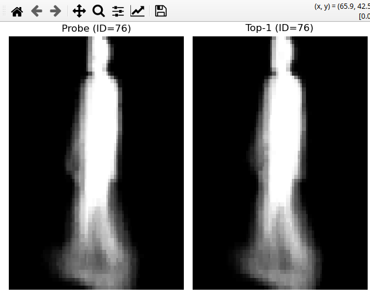
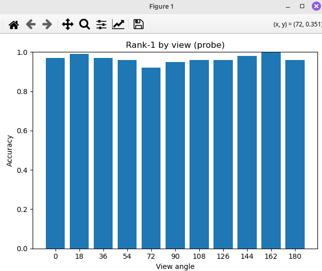
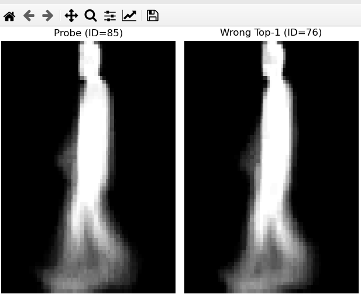
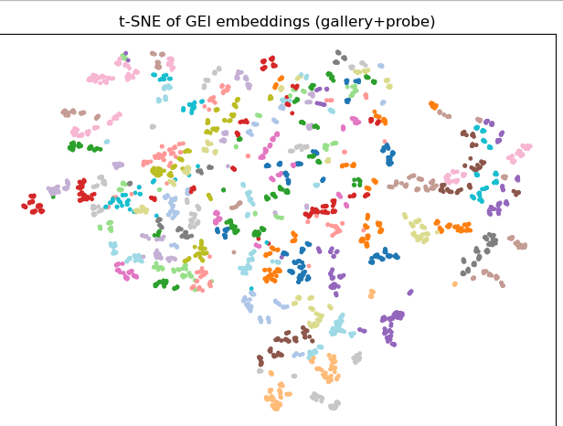

ca sa rulez ca modul si sa nu am probleme cu importurile:

```
python3 -m models.cnn_gei

```

o duce in 58-56% pentru 20 epoci si lr 1e-3 care orc e cam micut 

Ce urmeaza:

- imbunatatire gei: experimentat cu diferite loss functions , LR schedule (StepLR, CosineAnnealingLR)
- trb scris testarea


<h2> Table of contents </h2>

[Description of project](#description-of-project)

[Appearance based approach](#appearance-based-approach)

[Model based approach](#model-based-approach)

[Conclusion and further work](#conclusion-and-further-work)

## Description of project 

<p> Gait recognition cnn implementation using 2 approaches I studied after reading research papers in this domain. For now only cnn based, I will continue with GCN for my bachelor thesis.
</p>

### <u>Dataset</u> 


<p>
Most papars use CASIA-B dataset along with OUMVLP for performing comparison studies on how well the model adjusts. However for this summer practice I chose to go with the CASIA-B dataset.
</p>
<br> 


<div style="border-left: 4px solid #2196F3; padding: 0.5em; background: #E3F2FD;">
<strong>NOTE:</strong> I did not include the actual CASIA-B dataset, you can download it 
from <a href="https://www.kaggle.com/datasets/trnquanghuyn/casia-b">here</a>.
</div>


#### Loading GEI (gate energy image)

The `gei_build.py` script converts each silhouette sequence (folder with PNG frames) into a single Gait Energy Image (GEI) by averaging binarized frames over time.

How to run: 
<div style="border: 4px solid #FFC0CB; padding : .65em .8em; background: #00d9ff5d;"> python3 gei_build.py
</div>

<br>
<div style="border-left: 4px solid #4CAF50; padding: .65em .8em; background: #e9f5e8ff;"> <b>Intuition</b>: A GEI is the per-pixel <i>mean occupancy</i> of the silhouette across a walking cycle. Bright pixels are where the body spends more time; darker pixels vary with motion. </div>
<br>
The script mirrors the input tree and writes one *.png per sequence folder:

```bash
data/CASIA-B-GEI/
  001/
    nm-01/
      000.png   ← GEI for that whole sequence
    nm-02/
      018.png
  002/
    ...
```

Then I pre-process each frame by converting it to grayscale, resize to (H=128, W=88) (CASIA-B convention) using nearest neighbor (keeps crisp silhouettes) then binarize with threshold THRESH=1:

```python
bin_im = (im > THRESH).astype(np.float32)  # pixels ∈ {0,1}
```

Then accumulate and average:

```python
acc += bin_im   # per-pixel sum over frames
gei = acc / count  # mean ∈ [0,1]

```

<strong>acc</strong> is a float32 array [128, 88] holding the sum of silhouettes, then dividing by the number of frames yields the GEI.


#### Loading sequences for GRU 

How to run: (in `data/` folder)
<div style="border: 4px solid #FFC0CB; padding : .65em .8em; background: #00d9ff5d;"> python3 seq_loader.py
</div> 
<p>
Here we keep the temporal order of frames and feed them to a GRU.
So:

- [ ] Each sample = a sequence of **L frames** (resized, normalized tensors).
    - Shape = `[L, 1, 128, 88]` (like a video clip in grayscale).

- [ ] Label = subject ID (e.g., person `001 → y=0`).

```python
transform = T.Compose(
    [
        T.Resize((128, 88)),
        T.ToTensor(),
        T.Normalize([0.5], [0.5])
    ]
)
```
This transform ensures every frame is:

- Resized to 128×88 (CASIA-B standard).

- Converted to a tensor [1, 128, 88] (grayscale).

- Normalized to range [-1, 1] (helps training stability).

Then we iterate through the frames:

```python
if total >= self.L:
    idxs = np.linspace(0, total-1, self.L, dtype=int).round().astype(int)
else:
    idxs = list(range(total)) + [total-1]*(self.L - total)

```
<div class="callout">
<p>If enough frames → uniformly sample L frames across sequence.
(e.g., if 100 frames, and L=20 → take frames [0,5,10,...,95]).
If fewer frames → take all and pad with the last frame until length = L.

This ensures all sequences return exactly L frames → [L,1,128,88].

</p></div>
</p>

## Appearance based approach


How to run:
<div style="border: 4px solid #FFC0CB; padding : .65em .8em; background: #00d9ff5d;"> python3 cnn-gei.py <br> python3 -m models.cnn_gei
</div> 
<br>
<p>
In this approach, I trained a Convolutional Neural Network (CNN) directly on GEI (Gait Energy Images) extracted from the CASIA-B dataset. Each GEI compresses a whole walking sequence into a single grayscale image, which the CNN uses as input. The architecture applies several convolutional + pooling layers to learn spatial gait features, then flattens them into a 128-dimensional embedding and passes them through a fully connected layer for classification. Training is performed with cross-entropy loss and Adam optimizer for 20 epochs. This model learns to classify gait patterns by subject ID and later serves as a backbone for rank-1 evaluation.

What I got: a 50-56 % accuracy for 20 epochs and a learing rate of 0.001

Then we test the model using the `rank1_eval.py` script

<div style="border: 4px solid #FFC0CB; padding : .65em .8em; background: #00d9ff5d;"> python3 rank1-eval.py --show-matches 6 --per-view --show-fails 6 --tsne
</div> 

<br>

```bash
Gallery: 2187 | Probe: 1100
Rank-1 (NM-only): 0.965

===Random top-1 matches===
[ 228] TRUE=84 PRED=84 cos=0.998
[  51] TRUE=76 PRED=76 cos=0.997
[ 563] TRUE=99 PRED=99 cos=0.998
[ 501] TRUE=96 PRED=96 cos=0.998
[ 457] TRUE=94 PRED=94 cos=0.995
[ 285] TRUE=86 PRED=86 cos=0.998

=== Accuracy by view (probe) ===
view 000: acc=0.970  (n=100)
view 018: acc=0.990  (n=100)
view 036: acc=0.970  (n=100)
view 054: acc=0.960  (n=100)
view 072: acc=0.920  (n=100)
view 090: acc=0.950  (n=100)
view 108: acc=0.960  (n=100)
view 126: acc=0.960  (n=100)
view 144: acc=0.980  (n=100)
view 162: acc=1.000  (n=100)
view 180: acc=0.960  (n=100)

=== Top 6 failures (by highest wrong cosine) ===
[ 257] TRUE=85  PRED=76  view=72  cos=0.998
[ 404] TRUE=92  PRED=114  view=144  cos=0.998
[ 354] TRUE=90  PRED=77  view=36  cos=0.997
[1082] TRUE=123  PRED=104  view=72  cos=0.997
[ 324] TRUE=88  PRED=93  view=90  cos=0.997
[1007] TRUE=119  PRED=113  view=108  cos=0.997
```

And some visuals:







And some wrong results (work in progress on improvement)


And the t-SNE diagram to see how well the model groups the matches:




</p>

## Model based approach

Instead of working with an average over all sequences we will pay attention to each sequence and see how the features vary in time. Basically what I did was:

1. <strong>Feature Extraction (CNN):</strong>
The CNN layers process the input data, whether it's raw sensor readings or images, to identify and extract meaningful spatial features or localized patterns. 
2. <strong>Temporal Learning (GRU):</strong>
The features extracted by the CNN are then fed into a GRU network. The GRU, a variant of a recurrent neural network (RNN), excels at handling sequential data by capturing both historical and new information to predict future states. 
3. <strong>Prediction:</strong>
The combined output from the CNN and GRU provides a more robust and accurate prediction or classification for the given task. 

If the sequence loader was already run go ahead and run the `cnn_gru_train.py` script:

<div style="border: 4px solid #FFC0CB; padding : .65em .8em; background: #00d9ff5d;"> python3 cnn_gru_train.py
</div> 
<br>
It will take around 10 minutes or so for 20 epochs. 

<b>What the loader returns:</b>

- For every sequence dir (e.g., 001/nm-01/000/), sample L frames uniformly in time.

- Each frame is resized to 128×88, converted to grayscale and normalized.

- One sample is a tensor x ∈ ℝ^{L×1×128×88} with label y (subject index).

Why sample uniformly? <br>
Sequences have different lengths. Uniform sampling keeps early/mid/late motion without bias and makes all inputs fixed length.

<small>Snippet (shape only):</small>

```python
x: torch.Tensor  # [L, 1, 128, 88]
y: int           # subject label in [0..73]
```
Then apply the same CNN to each frame (weights shared across time).  
After convs + pooling + global pooling, each frame becomes a **128-D vector**.

Mathematically, for frame *t*:

$$
\mathbf{f}_t = \text{CNN}(\mathbf{x}_t) \in \mathbb{R}^{128}
$$

Stacking over time gives a sequence:

$$
\mathbf{F} = [\mathbf{f}_1, \ldots, \mathbf{f}_L] \in \mathbb{R}^{L \times 128}
$$

<small>Shape flow per frame: `[1, 128, 88] → … → [128]`.</small>

#### <u> GRU temporal encoder </u>

A **GRU (Gated Recurrent Unit)** processes the feature sequence and produces a sequence of hidden states,  
keeping a *running memory* of past motion.

For $$ t = 1 \ldots L$, with input $\mathbf{f}_t$ and previous hidden $\mathbf{h}_{t-1}$$ :

- **Update gate** (how much to keep from the past):

$$
\mathbf{z}_t = \sigma(W_z \mathbf{f}_t + U_z \mathbf{h}_{t-1} + \mathbf{b}_z)
$$

- **Reset gate** (how much past to forget when proposing new info):

$$
\mathbf{r}_t = \sigma(W_r \mathbf{f}_t + U_r \mathbf{h}_{t-1} + \mathbf{b}_r)
$$

- **Candidate state**:

$$
\tilde{\mathbf{h}}_t = \tanh(W_h \mathbf{f}_t + U_h (\mathbf{r}_t \odot \mathbf{h}_{t-1}) + \mathbf{b}_h)
$$

- **New state**:

$$
\mathbf{h}_t = (1 - \mathbf{z}_t) \odot \mathbf{h}_{t-1} + \mathbf{z}_t \odot \tilde{\mathbf{h}}_t
$$

---

The last state $\mathbf{h}_L$ summarizes the whole walk.  
Optionally project it to a compact **embedding** $\mathbf{z} \in \mathbb{R}^{128}$ used for classification and retrieval.

<small>Shape flow: `[L, 128] → GRU → [L, H] → take h_L → [H] → (linear) → [128]`.</small>


#### Classifier & training objective

I attach a linear head over the final embedding to predict the **ID** among 74 training subjects:

$$
\hat{\mathbf{y}} = \text{softmax}(W \mathbf{z} + \mathbf{b}) \in \mathbb{R}^{74}
$$

**Loss:** standard cross-entropy

$$
\mathcal{L}(\hat{\mathbf{y}}, y) = - \log \hat{y}_y
$$

---

**Optimization tricks used**
- **AdamW** with small **weight decay** (regularization).  
- **Gradient clipping** (e.g., $\lVert g \rVert_2 \leq 1$) for recurrent stability.  
- **Mixed-precision (AMP)** on GPU for speed and memory.  
- Deterministic **seed** for reproducibility.  

---

Training log prints **epoch loss** and **train accuracy**.  
The best model is saved to:  `models/cnn_gru_nm.pth`


#### Rank-1 evaluation (sequence-level retrieval)

At test time i **don’t use the classifier**. I export **embeddings** for:

- **Gallery** = `nm-01..nm-04` for subjects **075–124**,  
- **Probe** = chosen split (default `nm-05..nm-06`; or `bg-01..02`; or `cl-01..02`).  

---

**Embedding extraction**

$$
\mathbf{z} = \text{normalize}(\text{GRU}(\text{CNN}(\text{sequence}))) \in \mathbb{R}^{128}, 
\quad \lVert \mathbf{z} \rVert_2 = 1
$$

---

**Similarity & Rank-1**

- Build matrices  
  $P \in \mathbb{R}^{N_p \times 128}, \quad G \in \mathbb{R}^{N_g \times 128}$  

- Cosine scores (since vectors are L2-normalized):  

  $$
  S = P G^\top \in \mathbb{R}^{N_p \times N_g}
  $$

- For each probe $i$, take the **nearest neighbor**  

  $$
  j^* = \arg \max_j S_{ij}
  $$

- **Rank-1 accuracy** = fraction of probes where predicted ID (gallery label at $j^*$) equals true probe ID.

---

**There is also :**
- **Per-view accuracy** (bar chart across angles 0..180).  
- **Random match visualization** (show the first frames from probe & its top-1 gallery).  
- **Optional t-SNE** of embeddings to check class separability.  

Images can be found in the `reports/` folder

## Conclusion and further work 

I had better accuracy with the GEI model, the cnn isn't that good simply because I need to study the topic more. If I choose to continue this in my bachelor thesis I will implement GCN too. For now I will get back to studying more ml topics. 
<p> 
</p>
